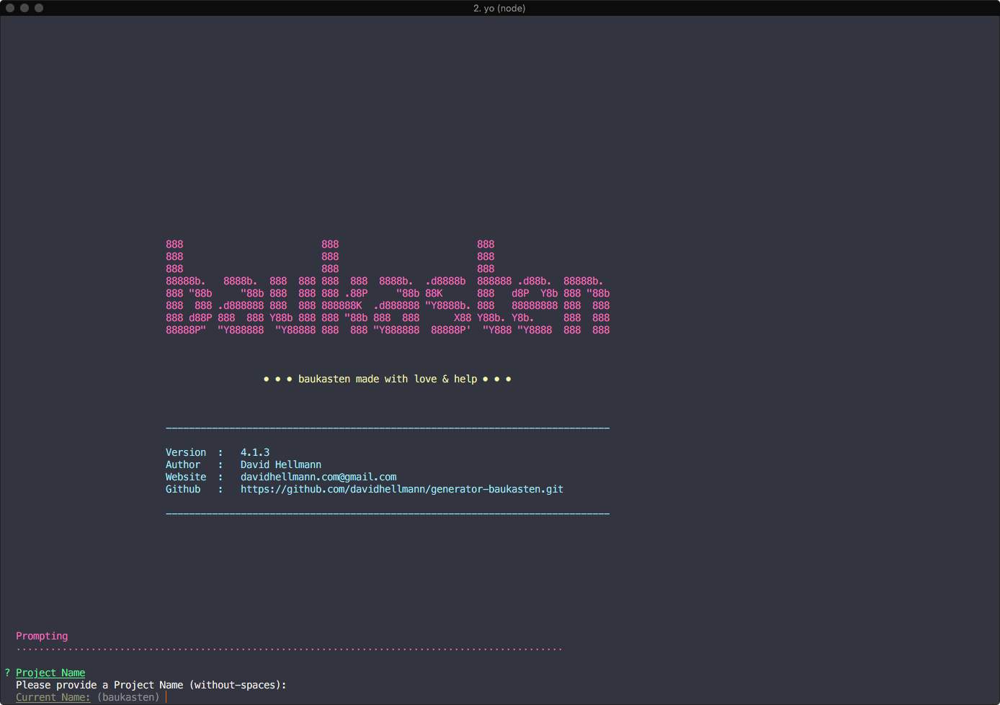

# Baukasten

[](https://travis-ci.org/davidhellmann/generator-baukasten)


```
   baukasten made with love & help.
   ---------------------------------------
   Author   :   David Hellmann
   Website  :   https://davidhellmann.com
   Github   :   https://github.com/davidhellmann/generator-baukasten
```

---

**Table of contents**

- [Intro](#intro)
- [Requirements](#requirements)
- [Installation](#installation)
- [Setup a new project](#setup-a-new-project)
- [Most important commands](#most-important-commands)
- [Scss Framework](#scss-framework)
- [Grid System](#grid-system)
- [Thanks](#thanks)
- [Roadmap](#roadmap)

---

## Intro

It's just a little 'Baukasten' or Boilerplate for your next Craft CMS or Prototyping Project. WordPress is also on Board
but has not the priority as the other ones. Most of the stuff fits for my own requirements and maybe you have the same
you can have a lot of fun with it. Give it a try.

## Requirments

```
yeoman
composer
node
yarn (npm works also)
```

## Installation

This installs Baukasten global on you computer

```
yarn global add generator-baukasten
```

## Setup a new project

Go to you project directory and run this command and run through the questions

```
yo baukasten
```



When you answered all question the generator do some magic.
When he's done and all is fine he runs an `yarn start` to initialize the project.

## Most important commands

When you need more details look at the `package.json`

```
yarn start         // run this command only if you setup a new project. Normally the generator execute this command by itself
yarn install       // to install NPM Packages
yarn dev           // to start the dev process. It runs a yarn build in front of that
yarn dev:single    // runs just the dev task without a build process in front
yarn build         // runs the build task
```

## Scss Framework

There is a little CSS Framework inside. It's simple as possible to have a good point to start.

### Settings

You can find this stuff here: `___src/assets/css/_______settings`

### Sass Functions

You can find this stuff here: `___src/assets/css/______tools`

### Sass Mixins

You can find this stuff here: `___src/assets/css/_______settings`

## Grid system

We've outsourced the Scss Grid Framework in his own NPM Package to use it in different environments
You can find it here: [https://github.com/davidhellmann/baukasten-grid](https://github.com/davidhellmann/baukasten-grid)
Or directly to the [Readme](https://github.com/davidhellmann/baukasten-grid/blob/master/readme.md)

To modify you settings you must open the `___src/assets/css/_______settings/_settings.breakpoints.scss` and there you can
change what you want. The dafaults look like this:

```scss
// Settings
$bk-grid-settings-custom: (
  cssgrid: false,
  cssgrid-fallback: false,
  flexboxgrid: true,
  testing: false,
  prefix: 'o-',
  units: (
    gutter: 8px,
    gutter-min-factor: 1,
    gutter-max-factor: 2,
    gutter-min-vertical-factor: 1,
    gutter-max-vertical-factor: 2,
  ),
  offset-classes: false,
  push-classes: false,
  pull-classes: false,
  disable-padding-horizontal: false,
  breakpoints: (
    min: (
      from: 320px,
      cols: 12,
      create-classes: true,
    ),
    xs: (
      from: 400px,
      cols: 12,
      create-classes: false,
    ),
    s: (
      from: 600px,
      cols: 24,
      create-classes: true,
    ),
    m: (
      from: 800px,
      cols: 24,
      create-classes: false,
    ),
    l: (
      from: 1000px,
      cols: 24,
      create-classes: true,
    ),
    max: (
      from: 1440px,
      cols: 24,
      create-classes: false,
    ),
  ),
);
```

## Thanks

- webdevs - for so many things: [Website](http://webdevs.xyz)
- Sascha Fuchs - for help help help: [Website](https://github.com/gisu)
- Martin Herweg - for help help help: [Website](https://github.com/martinherweg)
- CSS Tricks - for Easing Map: [Website](https://css-tricks.com/snippets/sass/easing-map-get-function/)
- Florian Kutschera - for the Material Design Box Shadows: [Website](https://medium.com/@Florian/freebie-google-material-design-shadow-helper-2a0501295a2d#.f1fz5ac2o)
- Hugo Giraudel & Eduardo Bouças - for include media: [Website](http://include-media.com/)
- @LukyVj - for family.scss: [Website](http://lukyvj.github.io/family.scss/)
- inuitcss - for some snippets and inspiration: [website](https://github.com/inuitcss/inuitcss)

## Roadmap

- Add Laravel as option
- Add Vue CLI as option
