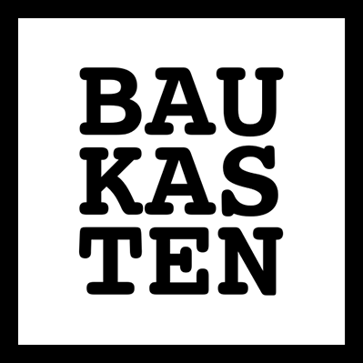

# <%= projectName %>

<% if (projectType === 'craftCMS3' ) { %>It's a [Craft CMS](https://craftcms.com/) project<% } %>
<% if (projectType === 'wordpress' ) { %>It's a [WordPress](https://wordpress.org/) project<% } %>

> I'm a new project. Describe me.


---

**Table of contents**

* [Requirements](#requirements)
* [Getting started](#getting-started)
* [Run Dev Task](#run-dev-task)
* [Run Build Task](#run-build-task)
* [More Informations](#more-informations)
* [Roadmap](#roadmap)
* [Branding](#branding)

---


## Requirements
* [YARN](https://yarnpkg.com/lang/en/) or [NPM](https://www.npmjs.com/)
* [NodeJS](https://nodejs.org/en/)
<% if (projectType === 'craftCMS3' ) { %>- [PHP](http://php.net/)
* [MySQL](https://www.mysql.com)
* [Composer](https://getcomposer.org/)<% } %>
<% if (projectType === 'wordpress' ) { %>- [PHP](http://php.net/)
* [MySQL](https://www.mysql.com)<% } %>

## Getting started
```
git clone https://github.com/your/your-project.git
cd your-project/
yarn start
```

## Run Dev Task
```
yarn dev
```

## Run Build Task
```
yarn build
```


## More Informations
* [Baukasten Readme](https://github.com/davidhellmann/generator-baukasten/blob/master/README.md)
* [Baukasten Grid Readme](https://github.com/davidhellmann/baukasten-grid/blob/master/readme.md)


## Roadmap
* Something


## Branding
```
baukasten made with love & help.
---------------------------------------
Author   :   David Hellmann
Website  :   https://davidhellmann.com
Github   :   https://github.com/davidhellmann/generator-baukasten
```
